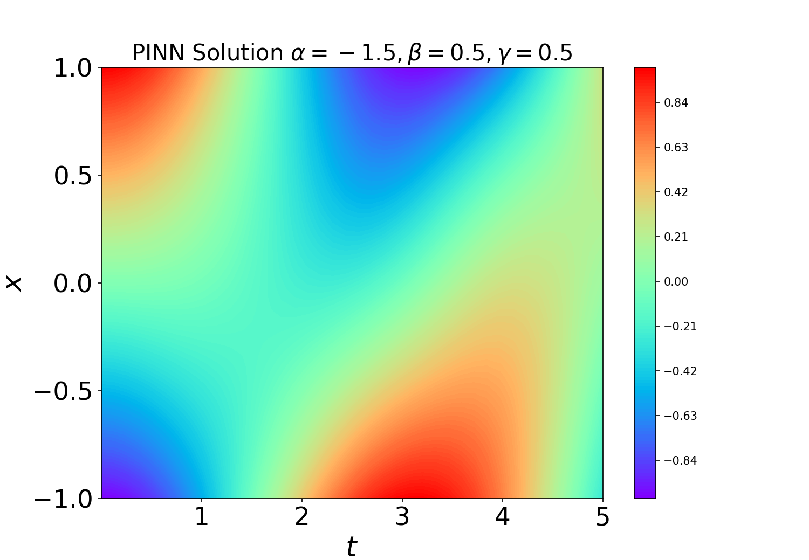
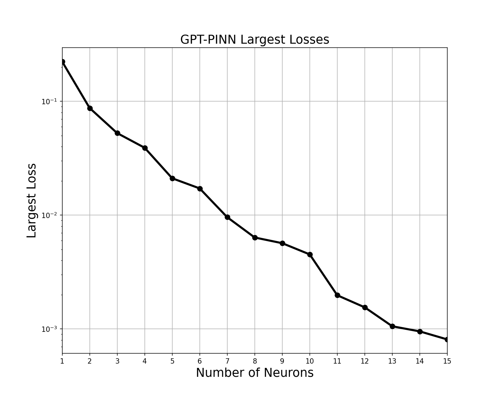
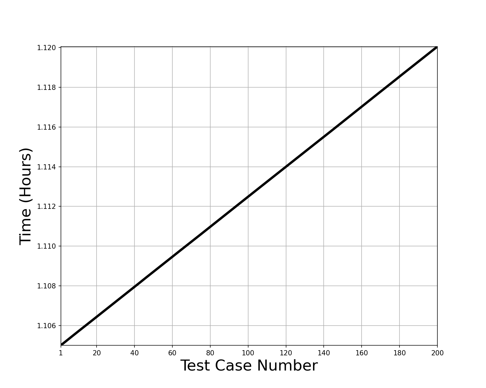

We try to solve KG function according to GPT-Pinn

Requirements

```
 Python     = 3.9.12
 NumPy      = 1.23.4
 PyTorch    = 1.11.0
 TensorFlow = 2.10.0
 Matplotlib = 3.6.2
```


You may also need SciencePlot and Latex as well
```
 pip install SciencePlot
 pip install Latex
```

GPU and CPU Support:
The aurthor stated GPU computation is better than CPU computation. However according to our test, GPU computation is as good as CPU computation. 1.12 hours(GPU) vs 1.18 hours(CPU)


For more details please see:
https://github.com/HangJin13/GPT-PINN/blob/main/README.md


Main results

This graph shows the numerical solution of Klein-Gordon function solved by GPT-Pinn.



This graph shows the largest losses of GPT-Pinn model respect to the number fo neurons.
In this case, we use 15 neurons in total. However we believes if we have more neurons we will learn a better solution.


This graph shows the time cost(hours) vs the total number of case. Note that we need 1 hour for only 1 case, but 1.12 hours for 200 cases. Thus, this model is effecient when we have many test cases.