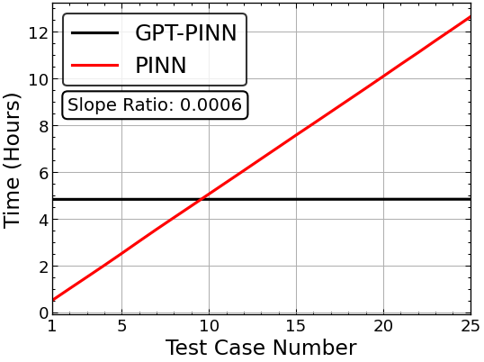

# Generative Pre-Trained Physics-Informed Neural Network Implementation

## GPT-PINN: Generative Pre-Trained Physics-Informed Neural Networks toward non-intrusive Meta-learning of parametric PDEs

### Yanlai Chen<sup>1</sup>, Shawn Koohy<sup>1</sup>

## Paper: https://arxiv.org/abs/2303.14878


*GPT-PINN Architecture*

## Abstract: 
<em>Physics-Informed Neural Network (PINN) has proven itself a powerful tool to obtain the numerical solutions of nonlinear partial differential equations (PDEs) leveraging the expressivity of deep neural networks and the computing power of modern heterogeneous hardware. However, its training is still time-consuming, especially in the multi-query and real-time simulation settings, and its parameterization often overly excessive. In this paper, we propose the Generative Pre-Trained PINN (GPT-PINN) to mitigate both challenges in the setting of parametric PDEs. GPT-PINN represents a brand-new meta-learning paradigm for parametric systems. As a network of networks, its outer-/meta-network is hyper-reduced with only one hidden layer having significantly reduced number of neurons. Moreover, its activation function at each hidden neuron is a (full) PINN pre-trained at a judiciously selected system configuration. The meta-network adaptively “learns” the parametric dependence of the system and “grows” this hidden layer one neuron at a time. In the end, by encompassing a very small number of networks trained at this set of adaptively-selected parameter values, the meta-network is capable of generating surrogate solutions for the parametric system across the entire parameter domain accurately and efficiently.</em>

</sub></sub><sub>1</sup> University of Massachusetts Dartmouth, Department of Mathematics, North Dartmouth, MA</sub></sub><br>

## Requirements:
```
Python     = 3.9.12
NumPy      = 1.23.4
PyTorch    = 1.11.0
TensorFlow = 2.10.0
Matplotlib = 3.6.2
```
Combinations of different package versions (recent ones) will most likely be able to run the code with little to no change.  

## GPU and CPU Support:
The code was implemented with the intension of compution to be primarily preformed on the GPU. CPU computation can be done however, it will take much longer. 

## Usage:
The Klein-Gordon, Allen-Cahn, and Burgers' equation files are currently avaliable. Running `KG_main.py`, `B_main.py`, or `AC_main.py` (with the other files in the folder located in the same directory) will begin the training of the full-PINN and GPT-PINN, growing the GPT-PINN hidden layer size from 1 to 15 (Klein-Gordon) or 9 (Burgers' and Allen-Cahn). The Final GPT-PINN is then trained on the generated test cases. We've imporved the computational time of the GPT-PINN (as compared to what is presented in the current paper) by implmenting more methods of vectorization into the code. The changes in overall run time are presented below:


*Imporved Klein-Gordon Training and Testing Times*


*Imporved Burgers' Training and Testing Times*



*Imporved Allen-Cahn Training and Testing Times*

## Citation:
Below you can find the Bibtex citation:
```
@misc{chen2023gptpinn,
      title={GPT-PINN: Generative Pre-Trained Physics-Informed Neural Networks toward non-intrusive Meta-learning of parametric PDEs}, 
      author={Yanlai Chen and Shawn Koohy},
      year={2023},
      eprint={2303.14878},
      archivePrefix={arXiv},
      primaryClass={math.NA}
}
```
